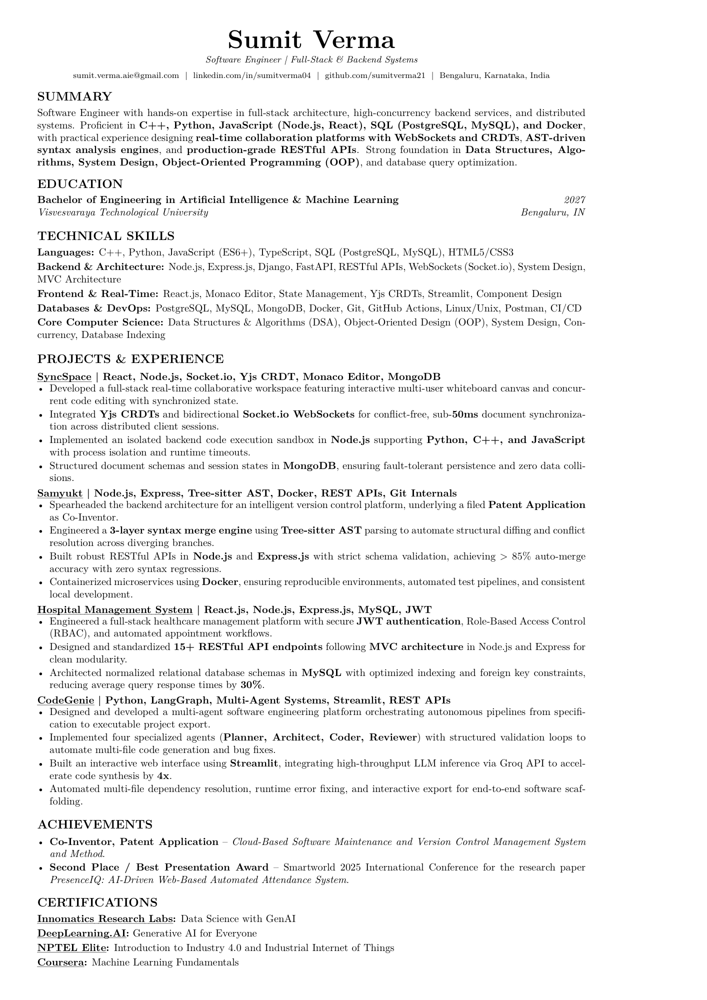
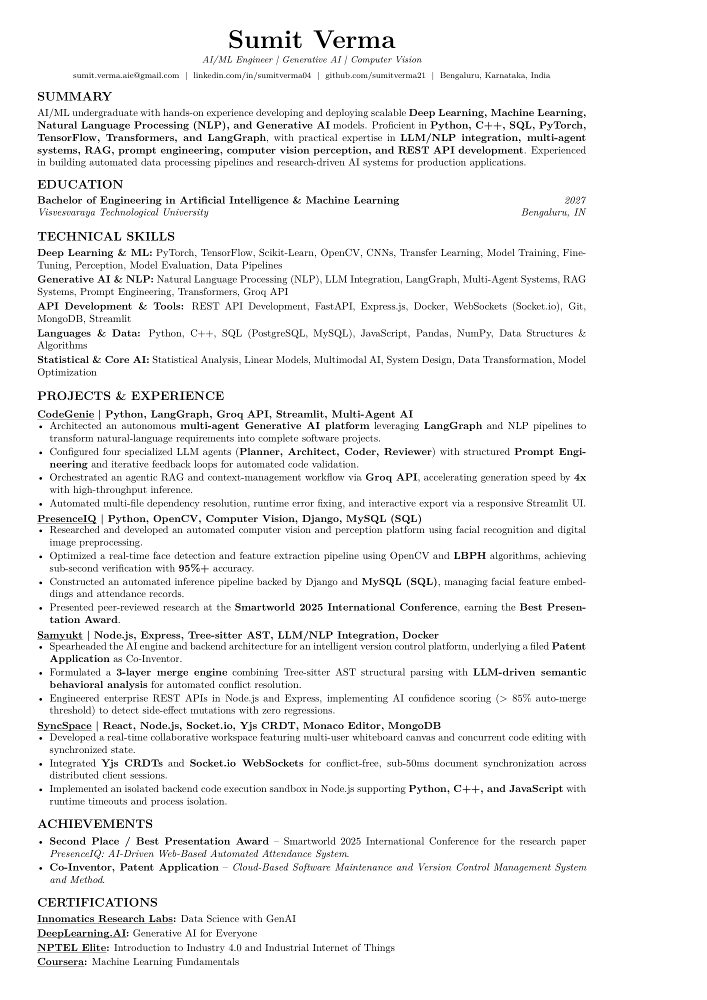

# ATS-Optimized Modular LaTeX Resumes

High-performance, ATS-compliant, single-page LaTeX resumes engineered for **Software Engineering** and **AI/ML & Generative AI** roles.

---

## 📄 Available Resumes

This repository contains two distinct, tailored resume targets:

1. **AI/ML Engineer | Generative AI | Computer Vision** (`resume-aiml.tex` & `resume.tex`):
   - **Target Roles:** AI/ML Engineer, Generative AI Engineer, Computer Vision Engineer, Machine Learning Specialist.
   - **Highlights:** LangGraph multi-agent systems, agentic RAG, OpenCV perception, Tree-sitter AST & semantic LLM behavioral merge engine, sub-second inference pipelines, published conference research paper.
   - **Output:** `sumit-verma-aiml.pdf` (and `sumit-verma.pdf`)

2. **Software Engineer** (`resume-swe.tex`):
   - **Target Roles:** Software Engineer, Full-Stack Engineer, Backend Systems Engineer.
   - **Highlights:** Full-stack distributed systems, WebSockets, Yjs CRDT real-time sync, sandboxed code execution, AST parser & Git merge engine, Co-Inventor patent application on version control, MVC architecture with 15+ REST endpoints in Node.js/Express, MySQL schema indexing & optimization.
   - **Output:** `sumit-verma-swe.pdf`

---

## 🖼️ Previews

### 1. Software Engineer Resume


### 2. AI/ML Engineer Resume


---

## 📂 Project Architecture

```text
├── resume-swe.tex              # Software Engineer resume entrypoint
├── resume-aiml.tex             # AI/ML Engineer resume entrypoint
├── resume.tex                  # Default / backward-compatible entrypoint
├── cv_template.cls             # Core LaTeX document class (ATS-optimized, 1-page fit)
├── links/                      # Contact information & profile URLs
│   ├── email.tex
│   ├── github.tex
│   ├── linkedin.tex
│   ├── location.tex
│   └── phone.tex
├── sections/                   # Modular resume sections
│   ├── summary-swe.tex         # SWE professional summary
│   ├── summary-aiml.tex        # AI/ML professional summary
│   ├── education.tex           # Education details
│   ├── achievements-swe.tex    # SWE achievements (Patent prioritized)
│   ├── achievements.tex        # AI/ML achievements
│   ├── certifications.tex      # Verified certifications
│   ├── skills/                 # Categorized technical skills
│   │   ├── swe-languages.tex   # SWE languages
│   │   ├── swe-backend.tex     # SWE backend & architecture
│   │   ├── swe-frontend.tex    # SWE frontend & real-time
│   │   ├── swe-database.tex    # SWE databases & DevOps
│   │   ├── swe-core.tex        # SWE core computer science
│   │   ├── ml-skills.tex       # Deep Learning & ML
│   │   ├── genai-skills.tex    # Generative AI & NLP
│   │   ├── backend-skills.tex  # API development & tools
│   │   └── programming-skills.tex # Languages & core AI
│   └── projects/               # Modular project descriptions
│       ├── SyncSpace-swe.tex   # SyncSpace (SWE focus: distributed real-time sync)
│       ├── Samyukt-swe.tex     # Samyukt (SWE focus: AST engine, Docker, REST APIs)
│       ├── HospitalMS.tex      # Full-stack Hospital Management System (React, Node, Express, MySQL)
│       ├── CodeGenie-swe.tex   # CodeGenie (SWE focus: autonomous software engineering agent)
│       ├── CodeGenie.tex       # CodeGenie (AI/ML focus: LangGraph, Groq RAG)
│       ├── PresenceIQ.tex      # PresenceIQ (CV focus: OpenCV, LBPH, face perception)
│       ├── Samyukt.tex         # Samyukt (AI/ML focus: semantic LLM behavior analysis)
│       └── SyncSpace.tex       # SyncSpace (Full-stack real-time collaboration)
└── .github/workflows/
    └── build-resume.yml        # GitHub Actions CI/CD to compile & release both PDFs
```

---

## 🛠️ Compilation

### Local Compilation (Fast & Self-Contained with Tectonic)
```bash
# Compile Software Engineer resume
tectonic resume-swe.tex

# Compile AI/ML Engineer resume
tectonic resume-aiml.tex
```

### Local Compilation (pdflatex / TeX Live)
```bash
pdflatex resume-swe.tex
pdflatex resume-aiml.tex
```

### Automated CI/CD (GitHub Actions)
Every `push` to `main` triggers `.github/workflows/build-resume.yml`, which:
1. Compiles both `resume-swe.tex` and `resume-aiml.tex` (plus `resume.tex`).
2. Generates high-resolution PNG previews.
3. Automatically publishes the latest PDF artifacts and creates a new GitHub Release with downloadable PDFs.
